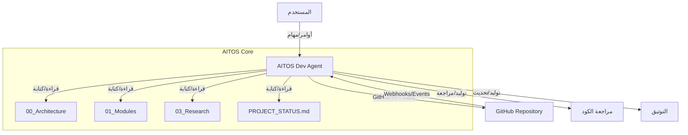

# مقترح وكيل تطوير AITOS (AITOS Dev Agent Proposal)

## 1. المقدمة

يهدف هذا المقترح إلى دمج "وكيل تطوير" (AITOS Dev Agent) كجزء أصيل من بنية مشروع AITOS v2. سيكون هذا الوكيل كياناً مستقلاً داخل النظام، مسؤولاً عن أتمتة المهام الهندسية والإدارية للمستودع، مما يتيح لـ AITOS القدرة على تطوير نفسه جزئياً ضمن حدود الصلاحيات الممنوحة له.

## 2. الرؤية والأهداف

*   **الرؤية:** تحويل AITOS إلى نظام ذاتي التطور، قادر على إدارة جوانب من دورة حياته البرمجية.
*   **الأهداف:**
    *   أتمتة مهام إدارة المستودع (إنشاء/تعديل الملفات، Commits، Pull Requests).
    *   تحديث الوثائق (Roadmap, Changelog, Specifications).
    *   مراجعة الكود الأولي والمساهمات.
    *   تسهيل عملية التطوير وتقليل التدخل البشري في المهام الروتينية.

## 3. المعمارية المقترحة لـ AITOS Dev Agent

سيعمل AITOS Dev Agent كوحدة نمطية مستقلة ضمن هيكل AITOS، مع واجهة برمجة تطبيقات (API) خاصة به للتفاعل مع GitHub.

## 4. المكونات الرئيسية

*   **GitHub API Client:** مكتبة Python للتفاعل مع GitHub API (مثل `PyGithub` أو `requests` مع بناء واجهة مخصصة).
*   **Task Orchestrator:** مكون يدير قائمة المهام الموكلة للوكيل، ويحدد أولوياتها، ويشغلها.
*   **Code Generator/Modifier:** مكون قادر على قراءة الكود والوثائق، وتوليد أو تعديل المحتوى بناءً على التعليمات.
*   **Documentation Manager:** مسؤول عن تحديث ملفات التوثيق مثل `ROADMAP.md` و `CHANGELOG.md`.
*   **Code Reviewer:** يستخدم نماذج لغوية كبيرة (LLMs) لمراجعة طلبات السحب وتقديم الملاحظات.
*   **Configuration:** ملفات تكوين خاصة بالوكيل لتحديد صلاحياته، مفاتيح API، والمجلدات التي يمكنه العمل عليها.

## 5. الأدوات والتقنيات الموصى بها

*   **اللغة:** Python (للتكامل السهل مع LLMs ومكتبات GitHub).
*   **GitHub API:** استخدام GitHub REST API أو GraphQL API.
*   **LLMs:** دمج نماذج لغوية كبيرة (مثل Gemini أو GPT) لمهام توليد الكود، مراجعة الكود، وتلخيص الوثائق.
*   **CI/CD:** استخدام GitHub Actions لتشغيل الوكيل بشكل آلي عند حدوث أحداث معينة (مثل فتح Pull Request).

## 6. التكامل مع هيكل AITOS الحالي

*   **مجلد الوكيل:** سيتم إنشاء مجلد جديد `05_Implementation/python/agent/` (أو `05_Implementation/agent/`) ليحتوي على الكود المصدري للوكيل.
*   **ملفات التكوين:** سيتم وضع ملفات التكوين الخاصة بالوكيل في `configs/agent/`.
*   **معايير الوكيل:** سيتم إضافة وثائق جديدة في `07_Standards/` تحدد قواعد عمل الوكيل، مثل `Agent_Operating_Rules.md` و `Agent_Security_Guidelines.md`.
*   **MODULE_INDEX:** سيتم إضافة `AITOS-DEV-AGENT` كوحدة جديدة في `MODULE_INDEX.md`.

## 7. الخطوات التالية

1.  تحديث `MODULE_INDEX.md` و `ROADMAP.md` لإضافة AITOS Dev Agent.
2.  إنشاء مجلدات الوكيل وملفات التكوين الأولية.
3.  تطوير واجهة GitHub API للوكيل.
4.  البدء في تنفيذ المكونات الأساسية للوكيل (Task Orchestrator, Documentation Manager).

## 8. اعتبارات الأمان

*   **صلاحيات محدودة:** يجب أن يتم منح الوكيل أقل الصلاحيات اللازمة لأداء مهامه (Least Privilege).
*   **مراجعة بشرية:** يجب أن تخضع جميع التغييرات التي يجريها الوكيل لمراجعة بشرية قبل الدمج في `main`.
*   **تسجيل الأنشطة:** يجب تسجيل جميع أنشطة الوكيل بشكل مفصل لأغراض التدقيق والأمان.
