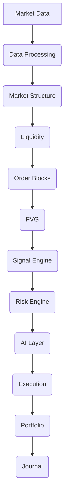

# Event Bus: AITOS v2 Event-Driven Architecture

## Table of Contents
1.  [Introduction](#1-introduction)
2.  [Purpose](#2-purpose)
3.  [Event Flow Pipeline](#3-event-flow-pipeline)
4.  [Core Concepts](#4-core-concepts)
    *   [Events](#events)
    *   [Publishers](#publishers)
    *   [Subscribers](#subscribers)
    *   [Event Contracts](#event-contracts)
5.  [Conclusion](#5-conclusion)

## 1. Introduction
This document defines the Event Bus architecture for AITOS v2, outlining how events are generated, propagated, and consumed throughout the system. An event-driven architecture is crucial for building a scalable, responsive, and loosely coupled trading platform.

## 2. Purpose
The primary purpose of the Event Bus is to:
*   **Decouple Modules:** Allow modules to interact without direct dependencies, enhancing modularity and maintainability.
*   **Improve Scalability:** Enable independent scaling of event producers and consumers.
*   **Enhance Responsiveness:** Facilitate real-time processing of market data and system state changes.
*   **Facilitate Auditing:** Provide a clear, chronological record of system activities through event logs.

## 3. Event Flow Pipeline
The following diagram illustrates the typical flow of events through the AITOS system:

**Explanation of Flow:**
*   **Market Data:** Raw tick and candle data are ingested.
*   **Data Processing:** Raw data is cleaned, normalized, and transformed into canonical `Candle` and `Tick` entities.
*   **Market Structure:** Events related to `Market Structure` changes (e.g., BOS, CHoCH) are published.
*   **Liquidity:** Events indicating `Liquidity Zone` formation or mitigation are published.
*   **Order Blocks:** Events related to `Order Block` identification are published.
*   **FVG:** Events for `Fair Value Gap` detection are published.
*   **Signal Engine:** Generates `Signal` events based on processed market insights.
*   **Risk Engine:** Consumes `Signal` events, applies `Risk Profile` checks, and publishes validated `Signal` events or risk alerts.
*   **AI Layer:** Consumes various events for higher-level decision-making, potentially publishing `AI Decision` events.
*   **Execution:** Consumes validated `Signal` or `AI Decision` events, publishes `Trade` events upon execution.
*   **Portfolio:** Consumes `Trade` events to update `Position` and `Portfolio` states.
*   **Journal:** Logs all significant events and decisions for auditing and analysis.

## 4. Core Concepts

### Events
*   **Definition:** Immutable records of facts or occurrences within the system. Events represent something that *has happened*.
*   **Attributes:** Each event must include a `timestamp`, `event_type`, `source_module`, and a `payload` containing relevant data (e.g., a `Candle` object, a `Signal` object).
*   **Naming Convention:** Events should be named in the past tense (e.g., `CandleClosed`, `SignalGenerated`, `TradeExecuted`).

### Publishers
*   **Definition:** Modules or components responsible for generating and emitting events to the Event Bus.
*   **Responsibilities:** Ensure events are well-formed, adhere to their respective `Event Contracts`, and are published reliably.

### Subscribers
*   **Definition:** Modules or components that listen for and react to specific types of events published on the Event Bus.
*   **Responsibilities:** Process events asynchronously, handle potential failures, and avoid creating tight coupling with publishers.

### Event Contracts
*   **Definition:** Formal specifications (e.g., JSON Schema) that define the structure and content of each event type.
*   **Purpose:** Ensure type safety, data consistency, and enable validation of events at runtime.
*   **Location:** Defined within `06_Interfaces/` (e.g., `MarketData.schema`, `Signal.schema`).

## 5. Conclusion
The AITOS Event Bus provides a robust and flexible foundation for the system's event-driven architecture. By adhering to these principles, we enable highly scalable, maintainable, and responsive operations, crucial for a high-performance algorithmic trading platform.
