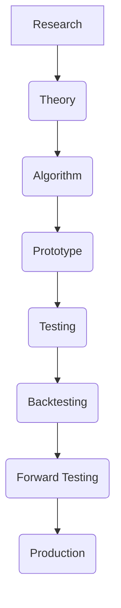

# Research Pipeline: Integrating New Trading Concepts into AITOS v2

## Table of Contents
1.  [Introduction](#1-introduction)
2.  [Purpose](#2-purpose)
3.  [Research Workflow Stages](#3-research-workflow-stages)
    *   [Research](#research)
    *   [Theory](#theory)
    *   [Algorithm](#algorithm)
    *   [Prototype](#prototype)
    *   [Testing](#testing)
    *   [Backtesting](#backtesting)
    *   [Forward Testing](#forward-testing)
    *   [Production](#production)
4.  [Conclusion](#4-conclusion)

## 1. Introduction
This document outlines the Research Pipeline within the AITOS v2 system, detailing the structured process for integrating new trading concepts, strategies, or analytical models into the platform. It ensures a rigorous, evidence-based approach from initial discovery to production deployment.

## 2. Purpose
The primary purpose of the Research Pipeline is to:
*   **Standardize Integration:** Provide a consistent and repeatable process for bringing new research into the AITOS system.
*   **Ensure Rigor:** Apply scientific and quantitative methods to validate new concepts.
*   **Minimize Risk:** Systematically test and evaluate new ideas before live deployment.
*   **Facilitate Collaboration:** Create a clear framework for researchers and developers to collaborate effectively.

## 3. Research Workflow Stages

### Research
*   **Description:** Initial exploration of a new trading idea, market anomaly, or quantitative technique. This involves literature reviews, data exploration, and preliminary hypothesis generation.
*   **Deliverables:** Research notes, initial data analysis, documented hypotheses in `03_Research/`.

### Theory
*   **Description:** Formalization of the research findings into a coherent theoretical model. This includes defining mathematical foundations, economic rationale, and explicit assumptions.
*   **Deliverables:** Theoretical model specification, mathematical derivations, detailed assumptions, documented in `03_Research/`.

### Algorithm
*   **Description:** Translation of the theoretical model into a precise, step-by-step algorithm. This stage focuses on the computational logic and decision rules.
*   **Deliverables:** Detailed algorithm description, pseudocode, flowcharts, documented in `01_Modules/[MODULE-ID]/ALGORITHMS.md`.

### Prototype
*   **Description:** Rapid development of a minimal viable implementation to test the core logic and feasibility of the algorithm. Focus is on functionality, not production readiness.
*   **Deliverables:** Working code prototype, initial test cases, documented in `01_Modules/[MODULE-ID]/examples/` or `03_Research/Experiments/`.

### Testing
*   **Description:** Comprehensive testing of the prototype or initial implementation. This includes unit tests, integration tests, and verification against known scenarios.
*   **Deliverables:** Passing unit tests, integration test reports, documented in `04_Tests/unit/` and `04_Tests/integration/`.

### Backtesting
*   **Description:** Rigorous evaluation of the algorithm's performance against historical market data. This involves simulating trades and analyzing performance metrics under various market conditions.
*   **Deliverables:** Backtest reports, performance metrics (Sharpe, Drawdown, Alpha), robustness analysis, documented in `04_Tests/backtesting/`.

### Forward Testing
*   **Description:** Deployment of the algorithm in a simulated live environment (paper trading) using real-time data. This validates performance and stability without real capital risk.
*   **Deliverables:** Forward test reports, real-time performance monitoring, operational stability reports, documented in `04_Tests/simulation/`.

### Production
*   **Description:** Full deployment of the validated module or strategy into the live trading environment. Continuous monitoring and maintenance are performed.
*   **Deliverables:** Live performance reports, risk monitoring, operational logs, documented in `01_Modules/[MODULE-ID]/CHANGELOG.md` and `PROJECT_STATUS.md`.

## 4. Conclusion
The AITOS Research Pipeline provides a systematic and robust framework for transforming new trading concepts from initial ideas into fully validated, production-ready components. This ensures that AITOS remains at the forefront of algorithmic trading innovation while maintaining the highest standards of quality and reliability.
