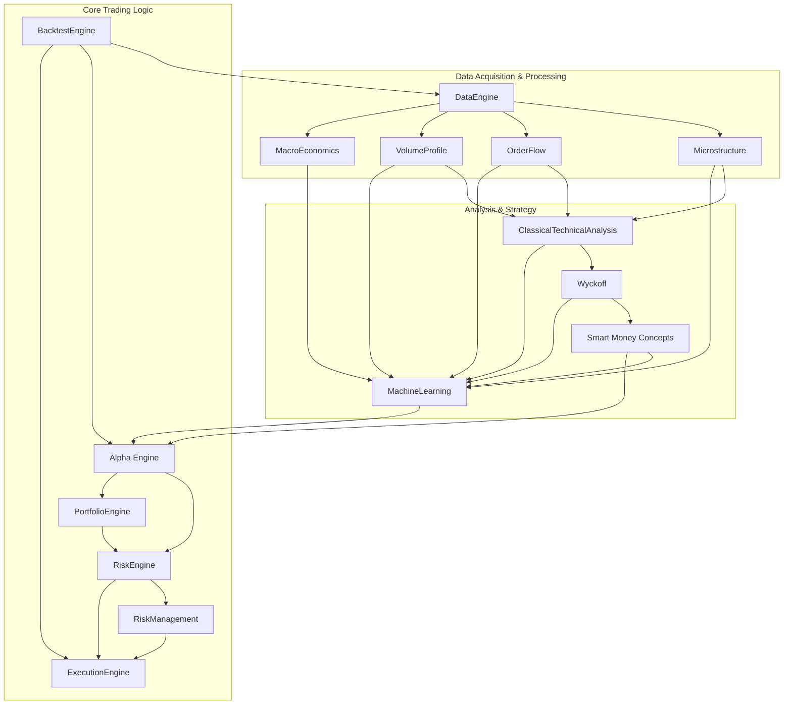

# اعتماديات الوحدات النمطية (Module Dependencies)

يوضح هذا المخطط الاعتماديات الرئيسية بين الوحدات النمطية المختلفة في نظام AITOS-v1. تهدف هذه الوثيقة إلى توفير فهم واضح لكيفية تفاعل المكونات مع بعضها البعض.

**ملاحظة:** هذا المخطط يمثل نظرة عامة على الاعتماديات. قد تكون هناك تفاعلات أكثر تفصيلاً داخل كل وحدة أو بين الوحدات الفرعية.
